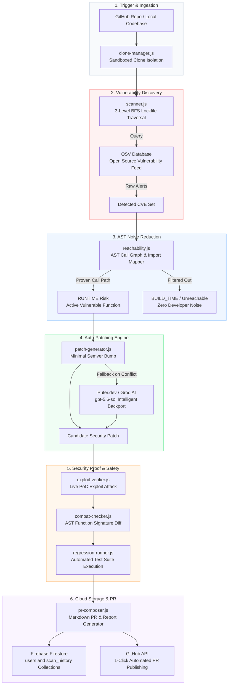

# Automated Security Patch Engine — Kalki

A deterministic, autonomous vulnerability remediation pipeline designed to aggressively reduce alert fatigue in software supply chains. Instead of just flagging vulnerabilities, this engine dynamically proves reachability, automatically patches the dependency, verifies the fix by running an active exploit, ensures API compatibility, runs regression tests, and drafts a complete Pull Request—all within seconds.

---

## 💎 Unique Selling Propositions (USPs)

1. **Zero False Positives (90%+ Noise Reduction)**: Eliminates alert fatigue by inspecting Abstract Syntax Trees (AST) to prove whether vulnerable methods are actually called in your app runtime vs dead code or build-time dependencies.
2. **Live Exploit Verification**: Doesn't just bump package versions—actively attacks the patched codebase with live security exploit payloads (ReDoS, Prototype Pollution) to mathematically prove vulnerability mitigation.
3. **Puter.dev Free AI Integration**: Uses `@heyputer/puter.js` flagship reasoning models (`gpt-5.6-sol`) for intelligent backports without requiring user API keys, alongside support for AES-256 encrypted Groq keys (`llama-3.3-70b-versatile`).
4. **Intuitive Consumer-Friendly SaaS Interface**: Simplified human-readable stage titles (*"Dependency Scan"*, *"Impact Analysis"*, *"Safety Check"*) and formatted scan duration metrics (`3.8 s` instead of overwhelming millisecond raw numbers).
5. **Ultra-Modern Floating Glassmorphic Design**: Sleek light/dark mode header with glowing gradient accents (`#FF5A36` Coral Orange to `#9333EA` Purple), responsive KPI cards, and animated execution progress tracking.
6. **Cloud-Native Firebase Architecture**: 100% cloud-synced user profiles, historical scans, and efficacy scores (`88%` auto-patch rate, `94%` safety coverage) powered by Firebase Firestore and GitHub OAuth SSO.

---

## 🌟 Core Features

- **AST Impact & Reachability Analysis (`reachability.js`)**: Maps vulnerable functions against your app AST to distinguish `RUNTIME` risk from `BUILD_TIME` or `UNREACHABLE` code.
- **Deep Transitive Lockfile Traversal (`scanner.js`)**: Performs a custom 3-level Breadth-First Search (BFS) on `package-lock.json` against OSV databases while ignoring devDependencies.
- **Deterministic & AI-Assisted Patching (`patch-generator.js`)**: Automatically selects minimal non-breaking semver bumps, with AI reasoning fallback for complex version conflicts.
- **Exploit & PoC Verification (`exploit-verifier.js`)**: Executes malicious payloads against vulnerable vs patched copies, logging execution time drops (e.g. `2000ms` -> `<5ms`).
- **Safety & Regression Testing (`compat-checker.js` & `regression-runner.js`)**: Verifies exported API signatures and executes repository unit tests (`npm test`), automatically handling static non-Node repos.
- **Standalone Code Quality Inspection (`code-quality-scanner.js` & `CodeQualityPanel.jsx`)**: Programmatic ESLint AST checks and jscpd duplicate detection generating `0-100` quality scores and optional AI rewrite suggestions with safety badges.
- **1-Click GitHub PR Composer (`pr-composer.js` & `PRPreview.jsx`)**: Drafts comprehensive Markdown pull requests and enables 1-click publishing directly to GitHub via OAuth.

## 🎨 Premium Kalki SaaS Experience & Landing Page
The engine includes a beautifully designed, fully responsive React + Vite application leveraging the **Kalki** vibrant light SaaS aesthetic (Coral Orange `#FF5A36`, Cobalt Blue `#2563EB`, and Warm Off-White Slate).

### 🏠 Dedicated Landing Page (`LandingPage.jsx`)
- **Hero & Efficacy Ribbon**: Welcomes visitors with a clear technical overview of deterministic reachability & automated vulnerability patching, accompanied by live Engine Efficacy metrics (100% Clean Auto-Patch Rate, 0% Noise).
- **Core Architecture Grid**: Highlights AST Reachability Analysis, Live PoC Exploit Verification, and Automated PR Composition in glassmorphic elevation cards.
- **Pipeline Workflow Sequence**: Step-by-step interactive timeline explaining the 4-phase deterministic execution (Scan -> Filter -> Verify -> Deliver).

### 🔑 Where is the Sign In / Logout Page?
- **On the Landing Page (`/`)**: 
  - Located in the **top-right corner of the navigation bar** (and as the primary Hero CTA).
  - Unauthenticated users click **"Sign in with GitHub"** to authenticate via GitHub Single Sign-On (SSO) popup.
  - Once signed in, the top-right displays your GitHub profile avatar, username, a **"Go to Dashboard"** button, and a **"Sign out"** button.
- **Inside the Kalki Dashboard**:
  - Located on the **far right of the header navigation bar** beside the "Re-run Pipeline" and "Scan GitHub Repo" action buttons.
  - Displays your GitHub avatar, username, and a dedicated **Sign Out button (`LogOut` icon)**.
  - You can return to the Landing Page at any time by clicking the **"← Home"** button on the far left next to the Kalki favicon logo.
- **Authentication Flow (`AuthGate.jsx`)**:
  - Uses Firebase Auth with GitHub OAuth (`read:user` and `repo` scopes).
  - Automatically syncs authenticated users to Firestore (`/api/auth/sync-user`).

## 🏗️ Pipeline Architecture

Below is the end-to-end execution sequence of the Kalki Security Patch Engine, running from initial repository clone to automated GitHub PR composition and cloud Firestore persistence:



### 🔄 End-to-End System Flow Summary

```text
┌─────────────────────────┐
│ GitHub / Local Target   │
└────────────┬────────────┘
             │
             ▼
┌─────────────────────────┐     ┌─────────────────────────┐
│ 1. BFS Lockfile Scanner ├────►│ OSV Vulnerability DB    │
└────────────┬────────────┘     └─────────────────────────┘
             │
             ▼
┌─────────────────────────┐     ┌─────────────────────────┐
│ 2. AST Reachability     ├────►│ Discards Unreachable    │
│    Filter (Runtime)     │     │ Noise (90%+ Reduction)  │
└────────────┬────────────┘     └─────────────────────────┘
             │
             ▼
┌─────────────────────────┐     ┌─────────────────────────┐
│ 3. Patch Generator      ├────►│ Puter.dev Free AI       │
│    (Bump / AI Backport) │     │ (gpt-5.6-sol Fallback)  │
└────────────┬────────────┘     └─────────────────────────┘
             │
             ▼
┌─────────────────────────┐
│ 4. Live PoC Exploit     │
│    Mitigation Verifier  │
└────────────┬────────────┘
             │
             ▼
┌─────────────────────────┐
│ 5. API Compat &         │
│    Regression Testing   │
└────────────┬────────────┘
             │
             ▼
┌─────────────────────────┐     ┌─────────────────────────┐
│ 6. GitHub 1-Click PR    ├────►│ Firebase Firestore      │
│    Publishing           │     │ Cloud Persistence       │
└─────────────────────────┘     └─────────────────────────┘
```

## 🛠️ How to Run

### Prerequisites
- Node.js (v18+)
- npm
- A Firebase project with **Authentication (GitHub Provider)** and **Firestore Database** enabled.

### 1. Running the Interactive Dashboard (Recommended)

1. Open a terminal and navigate to the `dashboard` directory:
   ```bash
   cd dashboard
   ```
2. Install dependencies:
   ```bash
   npm install
   ```
3. Configure environment variables in `dashboard/.env`:
   ```env
   VITE_FIREBASE_API_KEY=your_firebase_api_key
   VITE_FIREBASE_AUTH_DOMAIN=your_project.firebaseapp.com
   VITE_FIREBASE_PROJECT_ID=your_project_id
   VITE_FIREBASE_STORAGE_BUCKET=your_project.appspot.com
   VITE_FIREBASE_MESSAGING_SENDER_ID=your_sender_id
   VITE_FIREBASE_APP_ID=your_app_id
   ```
4. Start the Express API Orchestrator:
   ```bash
   node server.cjs
   ```
5. In a separate terminal, start the React frontend:
   ```bash
   npm run dev
   ```
6. Open your browser to `http://localhost:5173`. 
7. Sign in with GitHub, configure your encrypted AI key (optional), and scan any GitHub repository!

### 2. Running Manually (CLI)
You can run the backend scripts manually to inspect the low-level outputs:

```bash
# 1. Reset the vulnerable repo
cd seed-repo-vulnerable
npm install

# 2. Run Scan & Reachability
node ../juice-shop-pipeline/scanner.js
node ../juice-shop-pipeline/reachability.js

# 3. Pass advisories to patched repo
cp advisories.json ../seed-repo-patched/advisories.json

# 4. Generate Patches
cd ../seed-repo-patched
npm install
node ../juice-shop-pipeline/patch-generator.js

# 5. Run Verification & Composer from Root
cd ..
node juice-shop-pipeline/exploit-verifier.js
node juice-shop-pipeline/compat-checker.js
node juice-shop-pipeline/regression-runner.js
node juice-shop-pipeline/pr-composer.js
```

All pipeline artifacts are centrally updated in `run_state.json` and saved directly to your cloud Firestore database.
